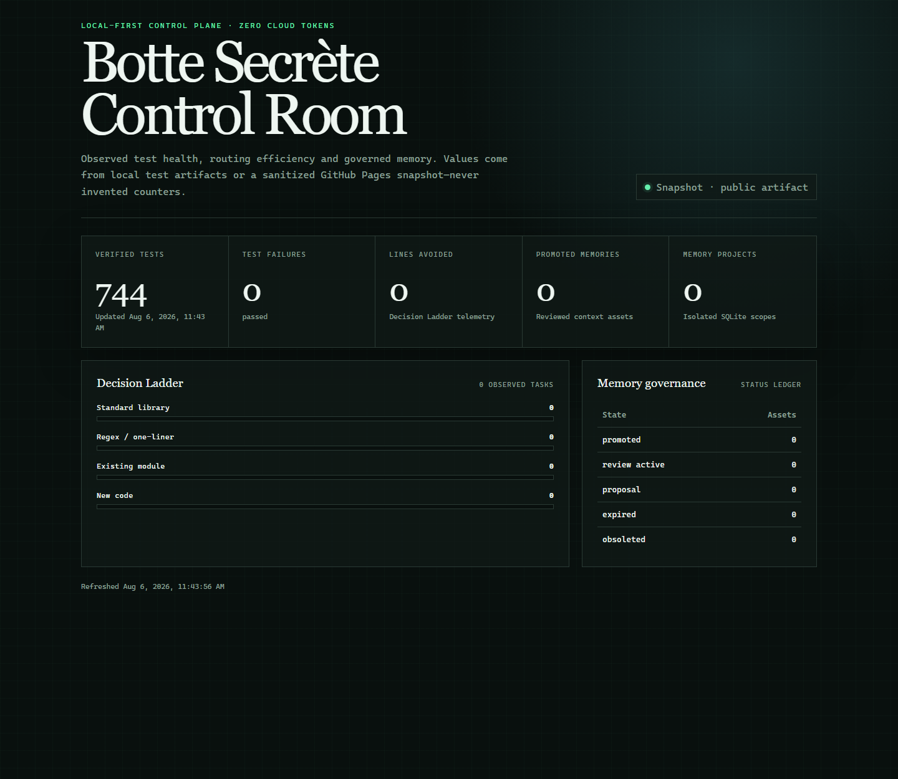
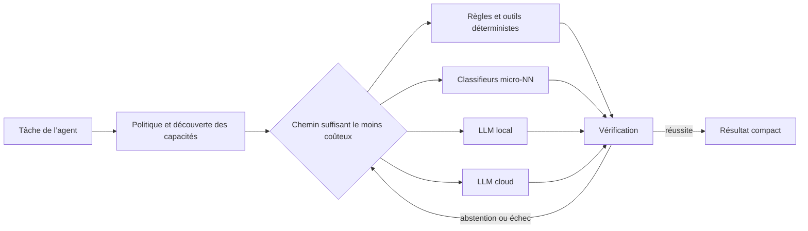
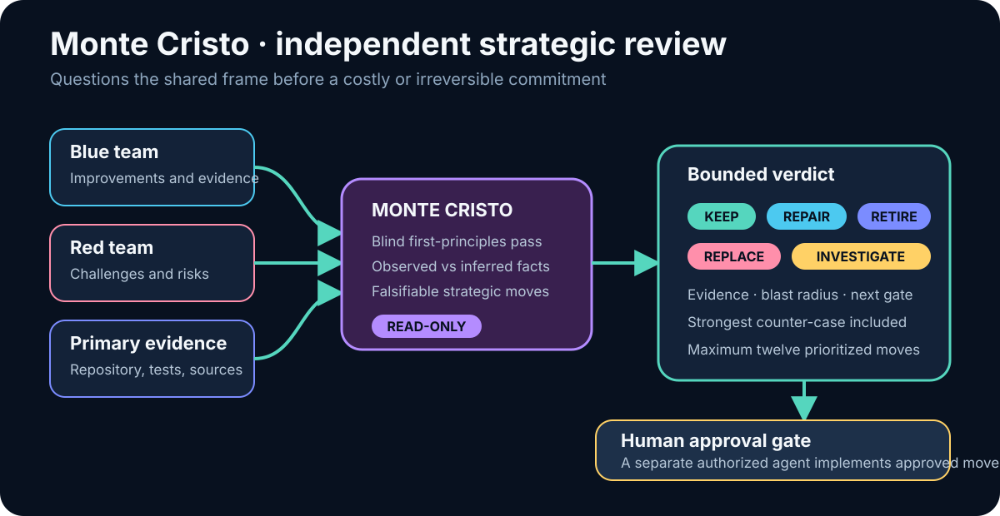
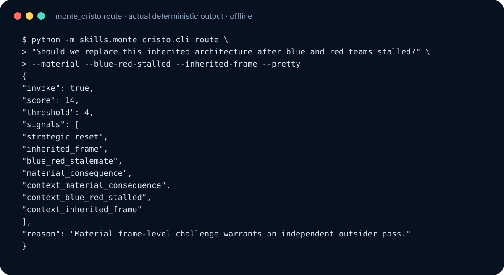
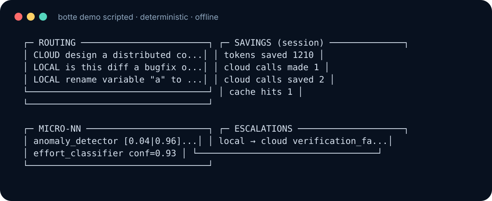
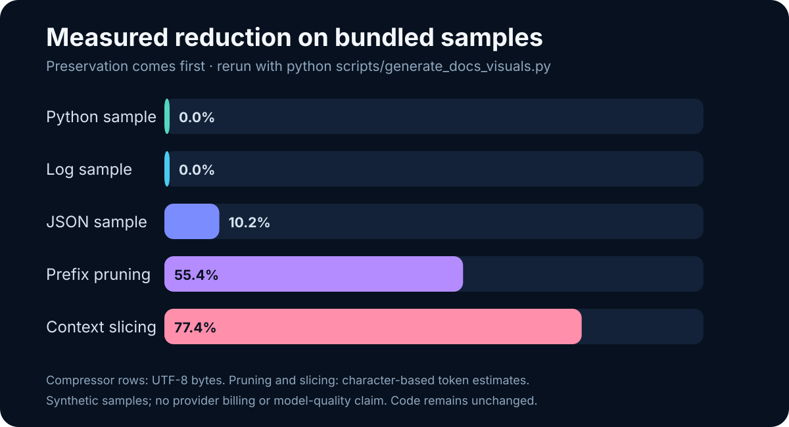
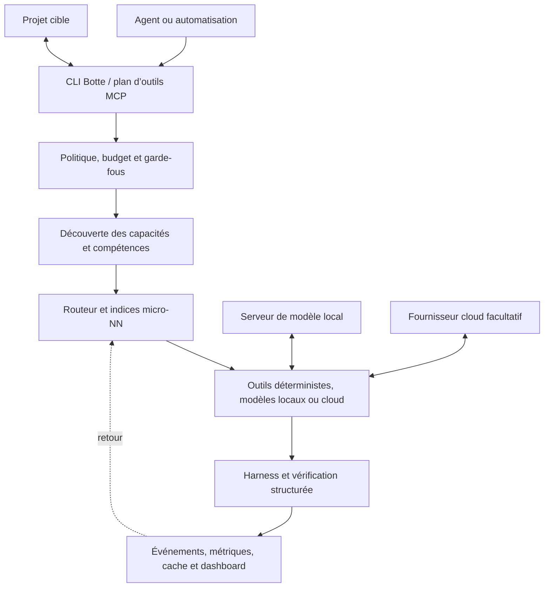

[](https://github.com/zedarvates/botte-secrete)

# Botte Secrète

[](https://github.com/zedarvates/botte-secrete/actions)
[](https://www.python.org/)
[](pyproject.toml)
[](LICENSE)

[English](README.md) · [Documentation](docs/README.md) · [Architecture](docs/ARCHITECTURE.md) · [Développement](docs/DEVELOPMENT.md) · [Contribuer](CONTRIBUTING.md)

**Un plan de contrôle local-first pour les agents de développement.** Botte
Secrète confie les tâches simples aux outils déterministes, aux petits
classifieurs ou aux modèles locaux ; réserve le cloud aux raisonnements qui le
nécessitent ; réduit le contexte et les sorties d’outils ; puis expose ce flux
par une CLI Python et MCP.



_Exemple d’instantané public sans données privées ; les valeurs générées sont
illustratives et ne constituent pas une télémétrie en direct._

Le projet est en **bêta**. Ses principaux flux fonctionnent localement, mais les
serveurs de modèles, fournisseurs cloud, accélérateurs matériels et agents tiers
restent des systèmes externes avec leurs propres limites de sécurité.

## Pourquoi Botte Secrète ?

Les agents consomment souvent des tokens coûteux pour des opérations qui ne
nécessitent pas un grand modèle : classer une demande, choisir un outil,
dédupliquer un journal, vérifier un schéma ou retrouver un résultat exact.
Botte ajoute une couche de décision peu coûteuse avant l’appel au modèle.



Le principe par défaut est : **utiliser le chemin vérifiable le moins cher**.
Local ne signifie pas fiable par nature ; les résultats passent encore par des
contrôles structurés, des preuves ou une escalade explicite.

## Ce que contient le projet

| Domaine | Fonction | Point d’entrée |
|---|---|---|
| Routage | Choisit une exécution déterministe, locale ou cloud | `botte route` |
| Mémoire qualité | Apprend des résultats vérifiés et explique les conseils k-NN en observation | `botte qa` |
| Diagnostic | Vérifie politique, directives, métriques, sécurité et dérive | `botte doctor` |
| Réduction du contexte | Compresse journaux, JSON, sorties d’outils et contexte sélectionné | `universal_compressor`, `context_budget` |
| Ceinture micro-NN | Fournit des indices de routage avec de petits classifieurs, pas des LLM | `botte belt` |
| Modèles locaux | Détecte les serveurs compatibles OpenAI, dont LM Studio et Ollama | `llm_backends` |
| MCP | Expose routage, découverte, audit et optimisation sur stdio | `botte-mcp` |
| Dashboard | Affiche les instantanés publics et les mesures locales | `botte dashboard` |
| Regard stratégique | Remet en question les hypothèses partagées par les équipes bleue et rouge avant une décision coûteuse | `monte_cristo` |

Les contrats détaillés vivent dans `skills/<nom>/SKILL.md`. Les flux entre
modules et les frontières de confiance sont décrits dans le
[guide d’architecture](docs/ARCHITECTURE.md).

## Agent stratégique : Monte Cristo

**Monte Cristo est le regard stratégique indépendant et en lecture seule de
Botte Secrète.** Les agents de l’équipe bleue améliorent le système et ceux de
l’équipe rouge le contestent ; Monte Cristo prend du recul lorsque les deux
équipes risquent de partager les mêmes hypothèses héritées.



_Schéma de gouvernance maintenu ; il décrit les limites d’autorité et
d’approbation, pas une trace d’exécution._

Utilisez-le avant une refonte d’architecture coûteuse, un programme de recherche,
une migration ou une décision dominée par les coûts déjà engagés. Ne l’utilisez
pas pour une revue de code ordinaire ou une correction étroite déjà vérifiée. Il
retourne des propositions bornées `KEEP`, `REPAIR`, `REPLACE`, `RETIRE` ou
`INVESTIGATE`, accompagnées de preuves et d’un prochain test. Il ne peut ni
modifier, déployer, acheter, publier, ni exécuter ses recommandations : toute
décision conséquente exige une approbation humaine et un agent d’implémentation
séparé.



_Capture CLI reproductible issue de l’évaluateur de routage déterministe hors
ligne ; elle prouve le câblage d’activation, pas la qualité de verdicts ouverts._

```bash
python -m skills.monte_cristo.cli route "Faut-il remplacer cette architecture héritée ?" --material --pretty
python -m skills.monte_cristo.cli template "Réévaluer la direction de la plateforme" --pretty
python -m skills.monte_cristo.cli eval --pretty
```

Consultez la [définition de l’agent](agents/monte-cristo.md), le
[guide d’utilisation](skills/monte_cristo/README.md) et le
[contrat de rapport validé](skills/monte_cristo/report.schema.json).

## Démarrage rapide

Prérequis : Python 3.10 ou plus récent et Git. Sous Windows, utilisez `python`.

### Installation depuis GitHub

```bash
python -m pip install git+https://github.com/zedarvates/botte-secrete.git
python -m skills.cli --help
python -m skills.auto_router.checkup_belt2
```

Déployez la configuration MCP et la politique locale dans un projet :

```bash
botte bootstrap /path/to/your-project
```

Le bootstrap conserve les serveurs MCP existants. Il écrit sa configuration et
ses rapports sous `.botte/`. Ces fichiers peuvent contenir des chemins absolus
propres à la machine et ne doivent pas être versionnés.

### Travail depuis un clone

```bash
git clone https://github.com/zedarvates/botte-secrete.git
cd botte-secrete
python -m pip install -e .
python scripts/run_tests.py -q
python -m skills.checkup.cli .
```

Le lanceur complet reste la source de vérité pour le nombre actuel de tests. Le
README n’immobilise donc plus ce chiffre changeant dans un badge.

## Démonstration hors ligne

La démonstration utilise des événements fixes. Elle n’appelle ni LLM ni réseau.

```bash
python -m skills.demo.cli scripted --speed 0 --no-clear
```



_Fixture hors ligne fixe ; il s’agit d’une sortie de démonstration reproductible,
pas d’une télémétrie de projet en direct._

Pour un vrai projet, utilisez `python -m skills.demo.cli live /path/to/project`
ou `botte dashboard /path/to/project --tui`. Ces vues lisent les événements
locaux ; elles ne prouvent une économie que si les mesures correspondantes sont
présentes.

## Benchmark mesuré

Le benchmark fourni teste compression, élagage, sélection de contexte et
micro-NN sur un corpus synthétique fixe. Il sert à repérer les régressions et ne
promet pas le même résultat pour chaque dépôt.

L'activation suit la
[roadmap de grounding](docs/plans/2026-08-06_micro-nn-grounding-roadmap.md) :
aucun nouveau micro-NN n'est activé tant qu'un modèle existant n'a pas une
source de labels auditable, des verdicts de production, une calibration et un
rollback. Utilisez `checkup` ou
`python -m skills.nn_audit.cli skills/botte_nn --json` pour l'état courant.



_Mesure effectuée sur les échantillons synthétiques fournis ; les résultats
varient selon le contenu. Consultez les [notes de provenance et de
régénération](docs/screenshots-plan.md)._

Régénérez le graphique et la capture de routage :

```bash
python scripts/generate_docs_visuals.py
python scripts/benchmark_full.py --json
```

La compression de code est volontairement prudente et rend l’entrée originale
si une transformation l’agrandit. La restauration est conservée en mémoire par
défaut ; sa persistance exige un stockage borné explicite.

## Architecture résumée



Botte ne possède ni l’agent, ni le dépôt cible, ni le serveur de modèle, ni le
fournisseur cloud. Le [guide d’architecture](docs/ARCHITECTURE.md) détaille les
flux, frontières de confiance et modules de référence.

## Sécurité et impact système

| Surface | Comportement par défaut |
|---|---|
| Réseau | Aucun accès pour les flux déterministes ; les modèles et opérations `--fresh` sont explicites |
| Télémétrie | Aucun suivi produit ni appel automatique à un service distant |
| Services | Aucun démon, démarrage automatique, `sudo` ou tâche planifiée par défaut |
| Projets cibles | Le bootstrap fusionne la configuration MCP sans remplacer les serveurs sans rapport |
| Événements locaux | Stockés sous `.botte/` dans le projet cible lorsque la fonction est utilisée |
| Vue multi-projets | Registre volontaire ; aucune découverte globale du système de fichiers |
| Identifiants cloud | Lus dans l’environnement par les adaptateurs ; inutiles pour les flux locaux |

Signalez toute vulnérabilité en privé selon [SECURITY.md](SECURITY.md).

## Carte de la documentation

| Objectif | Document |
|---|---|
| Trouver le bon document | [Index de la documentation](docs/README.md) |
| Comprendre le système | [Architecture](docs/ARCHITECTURE.md) |
| Développer ou tester Botte | [Guide de développement](docs/DEVELOPMENT.md) |
| Intégrer MCP | [Intégration MCP](docs/mcp-integration.md) |
| Connecter Hermes | [Intégration Hermes](docs/integrations/hermes.md) |
| Comprendre l’optimiseur de boucle | [Loop Optimizer](docs/loop-optimizer.md) |
| Consulter les versions | [Changelog](CHANGELOG.md) |
| Proposer une modification | [Guide de contribution](CONTRIBUTING.md) |

Les fichiers sous `docs/plans/`, `docs/research/` et les dossiers équivalents
décrivent des propositions ou expériences, pas automatiquement l’état actuel.

## Développement

```bash
python scripts/run_tests.py --changed -q
python scripts/pre-commit-check.py --fast
python scripts/test_readme_commands.py
python scripts/check_docs_links.py
```

Le cœur privilégie la bibliothèque standard. Les analyseurs et interfaces
installables utilisent les dépendances déclarées dans `pyproject.toml`. Toute
nouvelle affirmation publique devrait pointer vers un test, benchmark, schéma ou
fichier source vérifiable.

## Licence et auteur

Distribué sous [licence MIT](LICENSE). Créé par
[Sylvain Galliez](https://github.com/zedarvates).

Les possibilités de soutien sont décrites dans [DONATE.md](DONATE.md).
