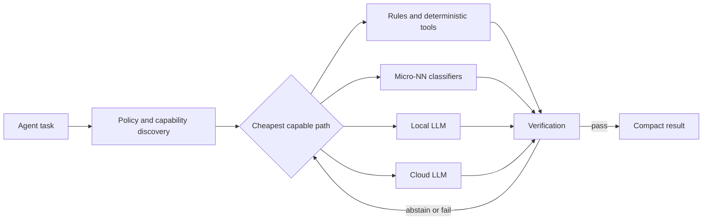
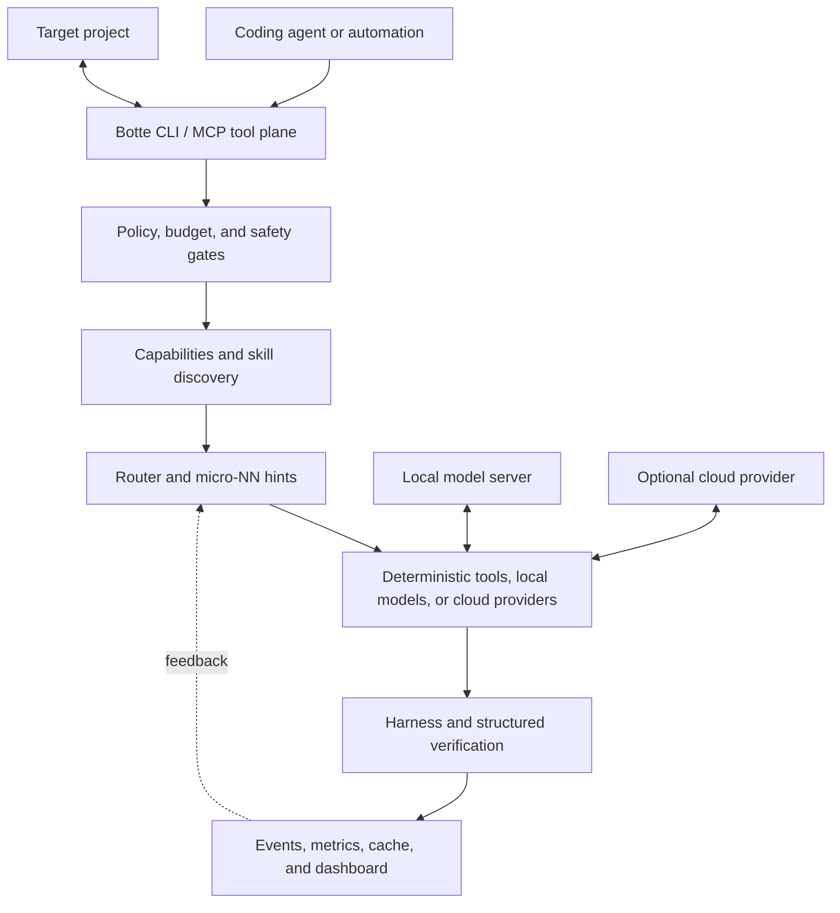

[](https://github.com/zedarvates/botte-secrete)

# Botte Secrète

[](https://github.com/zedarvates/botte-secrete/actions)
[](https://www.python.org/)
[](pyproject.toml)
[](LICENSE)

[Français](README.fr.md) · [Documentation](docs/README.md) · [Architecture](docs/ARCHITECTURE.md) · [Development](docs/DEVELOPMENT.md) · [Contributing](CONTRIBUTING.md)

**A local-first control plane for AI coding agents.** Botte Secrète routes cheap
work to deterministic tools, tiny classifiers, or local models; keeps cloud
reasoning for tasks that need it; reduces context and tool output; and exposes
the workflow through a Python CLI and MCP.


_Example public-safe dashboard snapshot; generated data is illustrative, not
live telemetry._

The project is in **beta**. Its core workflows run locally, but optional local
LLM backends, cloud providers, hardware accelerators, and third-party agents
remain external systems with their own setup and security boundaries.

## Why Botte Secrète?

Agent workflows often spend expensive model tokens on work that does not need a
large model: classifying a request, selecting a tool, deduplicating logs,
checking a schema, or recalling an exact result. Botte adds a cheap decision
layer before the model call.



The default principle is simple: **use the least expensive path that can be
verified**. Local does not mean trusted; model output still passes through
structured checks, evidence checks, or an explicit escalation path.

## What it includes

| Area | What it does | Entry point |
|---|---|---|
| Routing | Chooses deterministic, local, or cloud execution | `botte route` |
| Quality memory | Learns from verified outcomes and explains shadow k-NN advice | `botte qa` |
| Asset quality | Gates and compares images, textures, meshes, animations, and Godot packages | `botte asset-qa` |
| Project checkup | Audits policy, directives, metrics, security, and drift | `botte doctor` |
| Context reduction | Compresses logs, JSON, tool output, and selected context | `universal_compressor`, `context_budget` |
| Micro-NN belt | Runs tiny classifiers for routing hints; these are not LLMs | `botte belt` |
| Local models | Discovers OpenAI-compatible local backends such as LM Studio or Ollama | `llm_backends` |
| MCP | Exposes routing, discovery, audit, and optimization tools over stdio | `botte-mcp` |
| Dashboard | Renders public-safe snapshots and local operational views | `botte dashboard` |
| Strategic outsider | Challenges assumptions shared by blue and red teams before costly decisions | `monte_cristo` |

Detailed module contracts live in each `skills/<name>/SKILL.md`. Cross-module
flows and trust boundaries are described in the
[architecture guide](docs/ARCHITECTURE.md).

## Strategic agent: Monte Cristo

**Monte Cristo is Botte Secrète's independent, read-only strategic outsider.**
Blue-team agents improve a system and red-team agents challenge it; Monte Cristo
steps above both when they may share the same inherited assumptions.


_Maintained governance schema; it explains authority and approval boundaries,
not a runtime trace._

Use it before an expensive architecture reset, research commitment, migration,
or decision shaped by sunk cost. Do not use it for routine code review or a
narrow verified fix. It returns bounded `KEEP`, `REPAIR`, `REPLACE`, `RETIRE`,
or `INVESTIGATE` proposals with evidence and a validation gate. It cannot edit,
deploy, purchase, publish, or execute its recommendations; consequential moves
require human approval and a separate implementation agent.


_Reproducible CLI capture from the bundled deterministic offline route evaluator;
it demonstrates activation wiring, not the quality of open-ended verdicts._

```bash
python -m skills.monte_cristo.cli route "Should we replace this inherited architecture?" --material --pretty
python -m skills.monte_cristo.cli template "Reassess the platform direction" --pretty
python -m skills.monte_cristo.cli eval --pretty
```

Read the [agent definition](agents/monte-cristo.md), the
[usage guide](skills/monte_cristo/README.md), and the
[validated report contract](skills/monte_cristo/report.schema.json).

## Quick start

Requirements: Python 3.10 or newer and Git. Use `python` on Windows.

### Install from GitHub

```bash
python -m pip install git+https://github.com/zedarvates/botte-secrete.git
python -m skills.cli --help
python -m skills.auto_router.checkup_belt2
```

Deploy the MCP integration and local policy into a project:

```bash
botte bootstrap /path/to/your-project
```

Bootstrap preserves existing MCP servers. It writes project-local configuration
and reports under `.botte/`; those files may contain machine-specific absolute
paths and should stay out of version control.

### Work from a clone

```bash
git clone https://github.com/zedarvates/botte-secrete.git
cd botte-secrete
python -m pip install -e .
python scripts/run_tests.py -q
python -m skills.checkup.cli .
```

The complete test runner is the source of truth for the current test count. The
README intentionally does not freeze that moving number in a badge.

## See it work offline

The scripted demo uses fixed events. It does not call an LLM or the network.

```bash
python -m skills.demo.cli scripted --speed 0 --no-clear
```


_Fixed offline fixture; this is reproducible demo output, not live project
telemetry._

For a real project, use `python -m skills.demo.cli live /path/to/project` or
`botte dashboard /path/to/project --tui`. Those views read local event data;
they do not prove savings unless the underlying measurements are present.

## Measured benchmark

The bundled benchmark exercises compression, pruning, context selection, and
the micro-NN belt on a fixed synthetic corpus. It is a regression benchmark,
not a promise for every repository or workload.

Micro-NN activation follows the
[grounding roadmap](docs/plans/2026-08-06_micro-nn-grounding-roadmap.md): no new
model is activated while an existing predictor still lacks an auditable label
source, production verdicts, calibration, and rollback gate. Run `checkup` or
`python -m skills.nn_audit.cli skills/botte_nn --json` for the current status.

Asset Factory integrations can use the separate [Asset Quality Memory](skills/asset_quality/SKILL.md):
deterministic integrity and licence gates run first, then a family-isolated,
explainable k-NN baseline advises in shadow mode. The bundled
[mesh report](examples/asset-quality/mesh-report.json) is a complete input
example. No raw asset bytes or local paths enter its verified memory.

Hugging Face cards for the [micro-NN belt](distribution/huggingface/micro-nn/README.md)
and [Asset Quality Memory k-NN](distribution/huggingface/asset-quality-knn/README.md)
are staged with MIT metadata. Their final Hub URLs will be added here after the
owner namespace and existing repositories are verified; see the
[publication checklist](docs/huggingface-publication.md).


_Measured on the bundled synthetic samples; results vary with content. See the
[visual provenance and regeneration notes](docs/screenshots-plan.md)._

Reproduce both the benchmark chart and the routing capture:

```bash
python scripts/generate_docs_visuals.py
python scripts/benchmark_full.py --json
```

Code compression is deliberately conservative and may return the original
input when a transformation would expand it. Reversible compression is
in-memory by default; durable restoration requires an explicit bounded store.

```bash
python -m skills.universal_compressor.cli compress /path/to/file.log --type log
python -m skills.universal_compressor.cli compress /path/to/file.log --type log --reversible --store .private-compressor
```

## Architecture at a glance



Botte does not own the coding agent, target repository, model server, or cloud
provider. See the [architecture guide](docs/ARCHITECTURE.md) for data flow,
trust boundaries, and authoritative modules.

## Safety and system impact

| Surface | Default behavior |
|---|---|
| Network | No network call for deterministic workflows; model and `--fresh` operations are explicit |
| Telemetry | No product analytics or phone-home telemetry |
| Services | No daemon, startup entry, `sudo`, or scheduled task installed by default |
| Target projects | Bootstrap merges MCP configuration without replacing unrelated servers |
| Local event data | Stored under the target project's `.botte/` when the feature is used |
| Fleet view | Opt-in registry; no filesystem-wide discovery |
| Cloud credentials | Read from the environment by provider adapters; never required for local workflows |

Report vulnerabilities privately as described in [SECURITY.md](SECURITY.md).

## Documentation map

| Goal | Document |
|---|---|
| Find the right document | [Documentation hub](docs/README.md) |
| Understand the system | [Architecture](docs/ARCHITECTURE.md) |
| Develop or test Botte | [Development guide](docs/DEVELOPMENT.md) |
| Integrate MCP | [MCP integration](docs/mcp-integration.md) |
| Connect Hermes | [Hermes integration](docs/integrations/hermes.md) |
| Understand the loop optimizer | [Loop Optimizer](docs/loop-optimizer.md) |
| Review changes by release | [Changelog](CHANGELOG.md) |
| Propose a change | [Contributing guide](CONTRIBUTING.md) |

Documents under `docs/plans/`, `docs/research/`, and similarly labelled folders
describe proposals or experiments. They are not automatically current product
contracts.

## Development

```bash
python scripts/run_tests.py --changed -q
python scripts/pre-commit-check.py --fast
python scripts/test_readme_commands.py
python scripts/check_docs_links.py
```

The core is stdlib-first, while installable analyzers and interfaces use the
dependencies declared in `pyproject.toml`. New public claims should point to a
test, benchmark, schema, or source file that a contributor can inspect.

## License and author

Released under the [MIT License](LICENSE). Created by
[Sylvain Galliez](https://github.com/zedarvates).

Support options are listed in [DONATE.md](DONATE.md).
