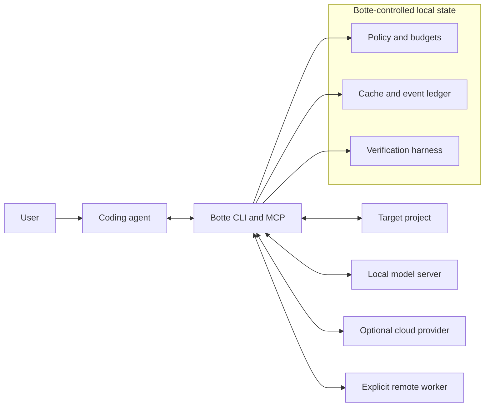
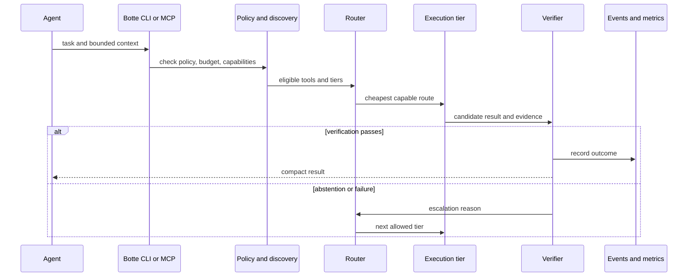
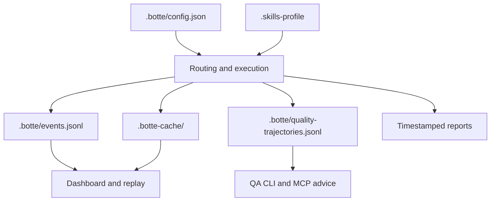

# Botte Secrète architecture

This document explains the current system boundaries and the main execution
path. Individual `skills/<name>/SKILL.md` files remain authoritative for module
commands and contracts.

## System boundary

Botte Secrète is a local-first optimization layer between an AI coding agent and
the execution resources available to it. It can inspect a target project, shape
context, select a tool or model tier, verify results, and expose those operations
over MCP.

It does **not** own or implicitly trust:

- the host agent or editor;
- the target repository;
- local model servers;
- cloud model providers;
- remote machines in a cluster;
- third-party tools discovered through MCP.



Every arrow crossing the Botte boundary is an integration boundary. Local
network location alone does not make an endpoint trusted.

## Architectural layers

| Layer | Responsibility | Primary implementation |
|---|---|---|
| Policy | Cost rules, typed missions, semantic rule contract, safe defaults | `.botte/policy.md`, `.botte/rules.json`, `run_contract`, `preflight` |
| Discovery | Project capabilities and relevant skills | `capabilities`, `skill_finder`, `llm_backends` |
| Routing | Effort, local/cloud tier, belt hints, fusion | `auto_router`, `tiered_router`, `botte_nn` |
| Optimization | Compression, pruning, token and context budgets | `universal_compressor`, `context_budget`, `token_shaper` |
| Execution | Local backends, leased Git worktrees, bounded automation | `llm_backends`, `meta_harness`, `local_harness` |
| Tool plane | MCP schemas, discovery, dispatch, lazy loading | `llm_mcp`, `mcp_gateway` |
| Observation | Events, verified quality memory, cache, reports, metrics, dashboards | `events`, `trajectory`, `cache`, `metrics`, `dashboard` |
| Governance | Independent review, rule drift, and security analysis | `meta_harness`, `directives_audit`, `checkup`, `security_scanner` |

The layers are logical, not separate services. Most modules are flat Python
packages under `skills/` and can be called directly or through the top-level
CLI.

## Request flow



### Route selection

The preferred order is:

1. Exact cache or reusable native capability.
2. Deterministic rule, parser, solver, or static analyzer.
3. Tiny classifier used as a routing hint.
4. Local language model wrapped in verification.
5. Cloud model when policy permits and the cheaper tiers are insufficient.

Micro-NN components are small classifiers. They do not generate language and
must not be described as nano-LLMs.

### Verification and escalation

The local harness supports structured-output checks, evidence-in-context checks,
citation existence checks, and syntax parsing. A failure should result in an
abstention or a policy-controlled escalation, not an invented answer.

The Loop Optimizer is shadow-only by default: it can propose and record a loop
decision without silently changing execution. See
[Loop Optimizer](loop-optimizer.md) for its rollout gates.

The Quality Compass is also shadow-only. It stores externally verified outcomes
as task fingerprints and sparse hashed features, uses k-nearest neighbors as an
explainable baseline, and exposes advice through `botte qa` and MCP. It never
changes the active route; high-impact work keeps a human gate, and model
self-reports cannot become labels.

## Data and state



Project-local files may contain absolute paths, discovered endpoints, or
operational history. Generated configuration is machine-specific and should not
be committed unless a module explicitly produces a sanitized public artifact.
The Quality Compass does not persist raw task text, but its fingerprints,
features, outcome labels, and evidence references remain private operational
data and follow the same rule.

The public dashboard generator copies the UI and writes a filtered JSON snapshot
that excludes local operational metrics. The screenshot embedded in the README
is generated from that public artifact.

## Security boundaries

- MCP input is untrusted input and must be validated against a bounded schema.
- Remote delegation requires an endpoint bound to the delegated host. HTTP is
  acceptable only on loopback; non-loopback delegation requires HTTPS and an
  explicit token.
- Tokens are sent in `X-Botte-Token` and must not appear in logs or reports.
- Cloud API keys are optional environment inputs, not repository configuration.
- Bootstrap merges existing MCP configuration instead of replacing it.
- Destructive project operations require an explicit workflow and human
  approval.

See [SECURITY.md](../SECURITY.md) for vulnerability reporting.

## Repository layout

```text
botte-secrete/
├── skills/              # Capability packages and their SKILL.md contracts
├── scripts/             # Repository-level tools, validation, and generators
├── docs/
│   ├── assets/          # Reproducible GitHub visuals
│   ├── integrations/    # Product integration guides
│   ├── plans/           # Proposals; not current contracts by default
│   ├── schemas/         # Stable machine-readable report contracts
│   └── wiki/            # Verified cross-module knowledge
├── examples/            # Bounded example configurations and harnesses
└── .github/              # CI and repository automation
```

## Evidence and freshness

Architecture descriptions should be updated when a public entry point, trust
boundary, state format, or cross-module flow changes. Moving counts such as test
totals and MCP tool totals belong in generated or dated evidence, not permanent
architecture claims.

Useful validation commands:

```bash
python scripts/run_tests.py --changed -q
python -m skills.checkup.cli .
botte rules audit .
python scripts/test_readme_commands.py
python scripts/check_docs_links.py
```
