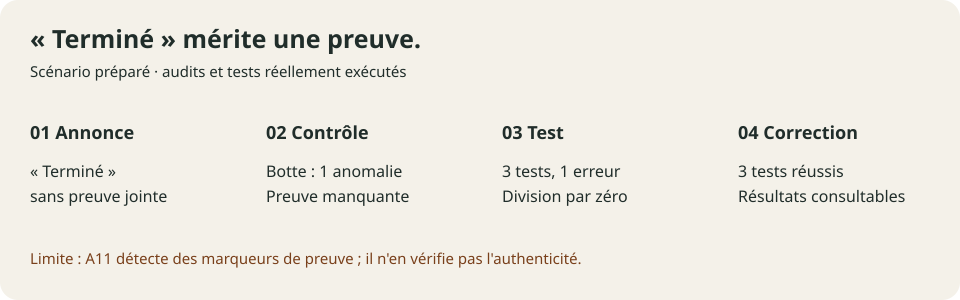

# « Terminé » mérite une preuve

**Botte Secrète repère une annonce sans preuve associée.** Cette démonstration
montre ensuite un vrai test en échec, une correction préparée et trois tests
réussis. Elle est locale, sans appel à un modèle, et rejouable avec Python 3.10+.



## Voir et rejouer

GitHub affiche ce récit et les pièces ci-dessous. Après téléchargement du dépôt,
ouvrir `docs/demos/completion-proof/demonstration.html` dans un navigateur pour
parcourir la présentation interactive de l'exécution enregistrée.

Depuis la racine du dépôt :

```text
python docs/demos/completion-proof/rejouer.py
```

La commande crée une nouvelle exécution dans `.botte-cache/completion-proof-demo/`
et y écrit `demonstration.html`. Le bouton HTML parcourt les résultats enregistrés ;
il ne relance pas les tests. `--output` choisit un autre dossier : il reçoit les
exécutions datées et les fichiers de présentation, qui sont actualisés.

## Ce qui se passe

| Étape | Observation réelle | Qui intervient ? |
|---|---|---|
| Annonce | Un rapport déclare la fonction moyenne terminée, sans preuve | Rapport synthétique préparé |
| Contrôle | Une anomalie `termine_sans_preuve` est signalée | Détecteur A11 de Botte |
| Test | Trois tests sont lancés, le cas vide provoque une division par zéro | Python unittest |
| Correction | Le cas vide retourne zéro, convention explicite de cet exemple | Version corrigée préparée |
| Validation | Les trois mêmes tests réussissent ; le rapport cite leur sortie et l'empreinte du code | Script de démonstration et Botte |

## Pièces de l'exécution publiée

- [Rapport initial](executions/20260913T160408788104Z/avant/rapport-agent.json)
- [Anomalie détectée par Botte](executions/20260913T160408788104Z/01-audit-avant.json)
- [Tests avant : une erreur](executions/20260913T160408788104Z/02-tests-avant.txt)
- [Tests après : trois réussites](executions/20260913T160408788104Z/03-tests-apres.txt)
- [Rapport corrigé avec références](executions/20260913T160408788104Z/apres/rapport-agent.json)
- [Nouvel audit : zéro constat](executions/20260913T160408788104Z/04-audit-apres.json)
- [Contre-exemple : référence fictive](executions/20260913T160408788104Z/controle-limite.json)
- [Résultat du contre-exemple](executions/20260913T160408788104Z/05-audit-limite.json)
- [Tests du détecteur](executions/20260913T160408788104Z/06-tests-detecteur.txt)
- [Résultats et provenance](executions/20260913T160408788104Z/resultats.json)
- [Empreintes des pièces](executions/20260913T160408788104Z/empreintes.json)
- [Nouveau : quatre vérifications des preuves](executions/20260913T160408788104Z/verification-summary.json)
- [Reçu de la version corrigée](executions/20260913T160408788104Z/apres-receipt.json)
- [Empreinte capturée séparément par l'exécuteur](executions/20260913T160408788104Z/apres-trusted-receipt.sha256)
- [Mode strict et clôture conditionnelle](executions/20260913T160408788104Z/strict-summary.json)

Les rapports sont conservés avec des chemins relatifs. Les éventuels chemins
absolus des journaux sont remplacés par `<local-root>` avant enregistrement.
Les empreintes concernent ces pièces publiées, après ce nettoyage, et les fichiers
sources du détecteur. Elles ne constituent pas une signature indépendante.

## Limites confirmées

- L'annonce et la correction sont mises en scène ; aucun agent autonome n'a été
  lancé. Les audits et les tests sont réellement exécutés.
- A11 contrôle des marqueurs déclaratifs, pas l'authenticité des preuves. Une
  référence fictive ne produit aucun constat dans le contre-exemple joint.
- Le CLI reste en mode rapport et retourne zéro même en présence d'anomalies.
  Il ne constitue pas un verrou automatique.
- Les trois tests prouvent trois comportements précis, pas une absence générale
  de bugs. La moyenne d'une liste vide vaut zéro uniquement par convention ici.
- Les résultats sont une capture datée, pas une télémétrie en direct.

## Vérification réelle ajoutée

Le nouveau mode `--verify`, distinct du détecteur A11, contrôle le reçu,
le journal et les empreintes du code et des tests. La démonstration capture
l'empreinte de référence séparément du rapport et montre quatre résultats :
test en échec, version corrigée vérifiée, autre version refusée, référence fictive
refusée. Le [contrat v1](../../../skills/completion_proof/VERIFICATION.md) précise
les entrées et la limite de confiance dans l'exécuteur.

## Améliorations suivantes

Le contrôle d'intégrité v1 et le mode `--verify --strict` sont implémentés.
La démo écrit un marqueur de clôture uniquement après un contrôle strict réussi.
La chaîne appelante doit respecter le code de sortie ; Botte ne change pas
elle-même l'état des tâches d'autres applications.

L'intégration avec un exécuteur générique et une mesure de fiabilité sur corpus
restent à développer. Voir la [suite proposée](ameliorations.md).
