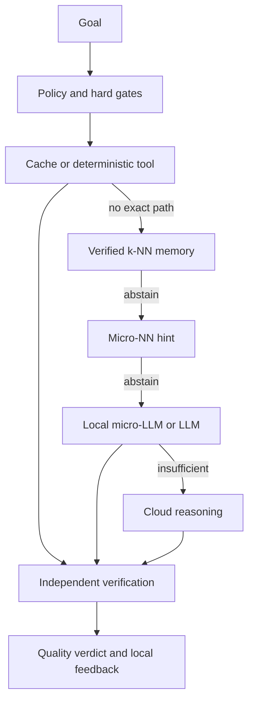

# Quality Compass and intuitive local-worker plan

Status: active, incremental
Owner: Botte Secrete maintainers
Date: 2026-08-25

## Outcome

Turn Botte Secrete into a fluid control plane where a person states the goal
once, sees the safest useful next action, and can inspect the evidence without
learning the internal routing vocabulary.

The system should become faster through verified local memory and specialized
workers while preserving human agency. Automation may suggest, simulate, and
prepare; consequential actions still require the relevant deterministic or
human gate.

## Interaction rules

1. **One front door.** `botte qa` shows state and one next step;
   `botte qa "task"` asks for advice without another subcommand.
2. **Progressive disclosure.** The default answer is verdict, reason, and next
   action. `--json` exposes full candidates and neighboring evidence.
3. **No invisible authority.** Every learned decision reports `shadow_only` and
   `acted`; the first implementation can never act.
4. **Evidence before confidence.** Tests, schemas, deterministic checks, replay,
   independent review, and human review can label outcomes. Model self-reports
   cannot.
5. **Preview and approval.** Security, credentials, publishing, deployment,
   deletion, spending, and other high-impact work bypass learned routing.
6. **Private by default.** Raw task text remains in memory only long enough to
   derive a local fingerprint and sparse feature vector.

## Decision ladder

The k-NN layer is a baseline and memory lookup, not a new authority. Generative
workers remain behind structured verification regardless of size or location.

## Qualitative reference system

| Verdict | Meaning | Typical evidence |
|---|---|---|
| `FAIL` | The intended result is wrong or unusable | Failed test, rejected schema, human rejection |
| `UNCERTAIN` | Evidence is incomplete or contradictory | Partial harness, missing replay, unresolved reviewer doubt |
| `PASS` | The requested result is verified in the stated scope | Green targeted tests, valid schema, accepted review |
| `PASS_ROBUST` | It also survives an independent or adversarial check | Replay, mutation/edge cases, independent verifier |

The routing utility is evaluated in this order:

1. hard safety and authorization gates;
2. verified quality floor;
3. cheapest sufficient route;
4. latency, tokens, monetary cost, energy, and memory pressure;
5. abstention when evidence is weak.

## Delivery waves

| Wave | Deliverable | Gate | State |
|---|---|---|---|
| 0 | Project-local verified ledger, privacy-preserving features, duplicate resistance | Focused tests and schema | Implemented in this change |
| 1 | Explainable k-NN baseline via Python, `botte qa`, MCP, and events | Shadow-only; never acts | Implemented in this change |
| 2 | Automatic outcome envelopes from harness, router, Codex runs, and CI | External evidence required; no backend-success labels | Local harness vertical slice implemented; other adapters next |
| 3 | Dashboard card: quality, coverage, abstentions, route comparison, next step | Public snapshots contain no local task data | Planned |
| 4 | Temporal benchmark: deterministic vs k-NN vs current micro-NN | No success loss; measured cost/latency benefit | Planned |
| 5 | Specialized micro-NN or micro-LLM workers | Existing micro-NN inventory reaches G2 or is retired | Gated |
| 6 | Staged authority | Simulate → shadow → 10% → 50% → 100%, with rollback | Gated |

## Which local mechanism to use

| Mechanism | Best fit | Update cycle | Verification |
|---|---|---|---|
| Deterministic code | Exact rules, security gates, schemas, budgets | Code review | Exact oracle |
| k-NN memory | Recurrent tasks with comparable verified precedents | Immediate append | Neighbor IDs and outcome evidence |
| Micro-NN | Stable classification or scoring boundary | Versioned training | Temporal holdout, calibration, drift |
| Micro-LLM | Short structured language transformations | Model/adaptor release | Schema plus task-specific harness |
| Larger local/cloud LLM | Novel synthesis and architecture | Provider/model release | Independent validator and human gate as needed |

Do not train a model merely because data exists. Promote a learned component
only when it beats the simpler baseline on representative, time-separated data.

## Outcome envelope for Wave 2

Every integrated execution should eventually emit the following bounded facts:

- mission/task ID and privacy-safe task fingerprint;
- project, task type, tags, risk and permission profile;
- selected route, model, harness, skill/tool versions;
- duration, tokens, monetary cost, energy/memory measurements when available;
- evidence references and verifier identity;
- qualitative verdict and numeric quality score;
- whether the advice acted, abstained, escalated, or required approval.

This envelope becomes the shared contract for Codex, Hermes, local workers,
Kanboard, CI, and the dashboard. Each integration may emit a partial envelope,
but it cannot invent missing evidence.

The first Wave 2 slice is `botte.quality-outcome/v1`, emitted by the local
harness into private project state. It represents partial, failure, uncertainty,
abstention, escalation, and approval states without persisting task text or raw
execution IDs. A replay-stable outcome ID prevents duplicate status rows and
duplicate quality labels. Only envelopes with an allowed external verifier and
an evidence reference are promoted into `botte.quality-trajectory/v1`.

## Acceptance criteria

- A newcomer can obtain state or advice with one command and understands the
  next action from the first three output lines.
- No raw task appears in the quality ledger or public event payload.
- Repeated copies of one task cannot satisfy grounding thresholds.
- High/critical risk always keeps a human gate.
- k-NN abstains on sparse or conflicting support and reports its neighbors.
- CLI and MCP declarations reach the same tested implementation.
- No micro-NN is trained or activated from unverified outcomes.
- Any future active rollout has a measured baseline, staged exposure, drift
  alert, and tested rollback.
